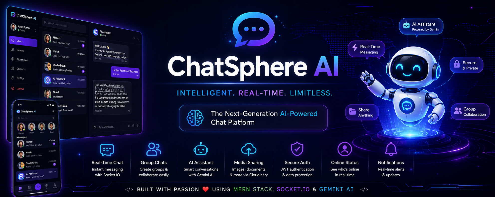
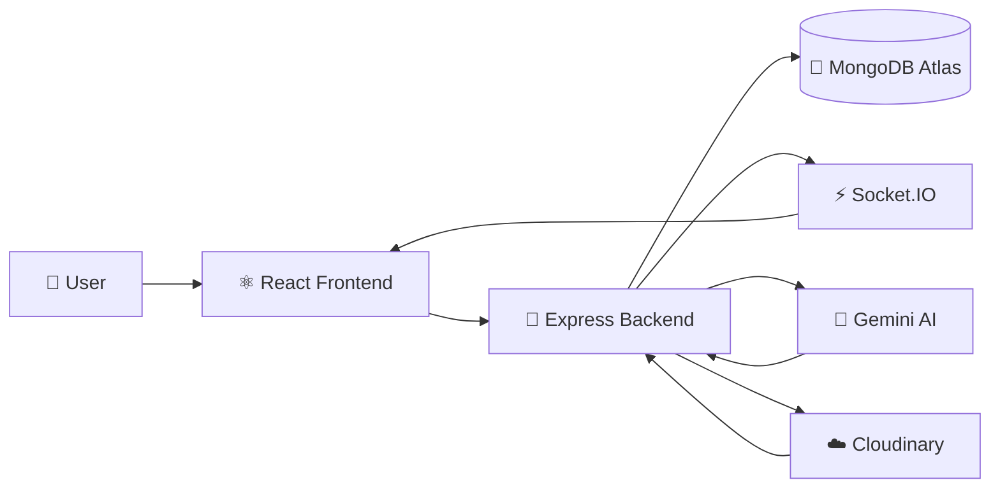
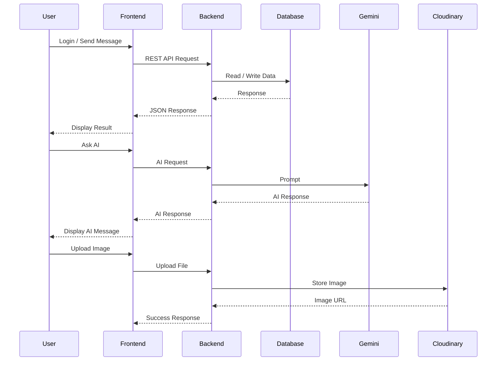
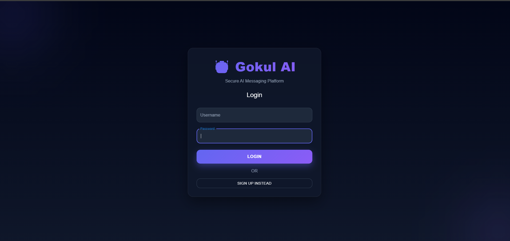
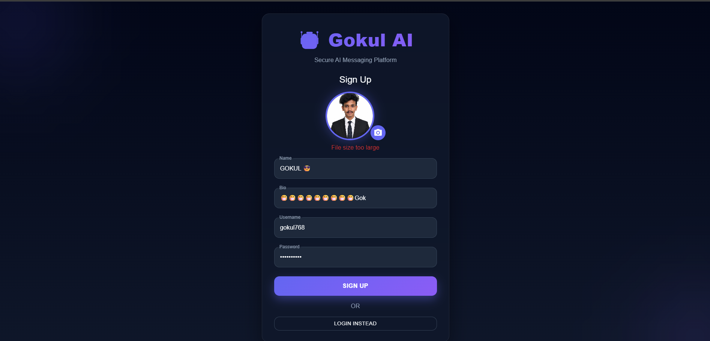
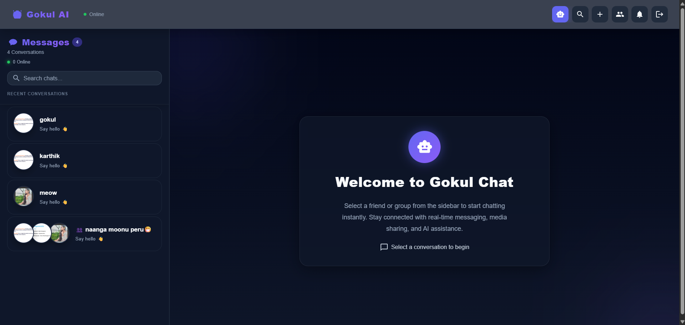
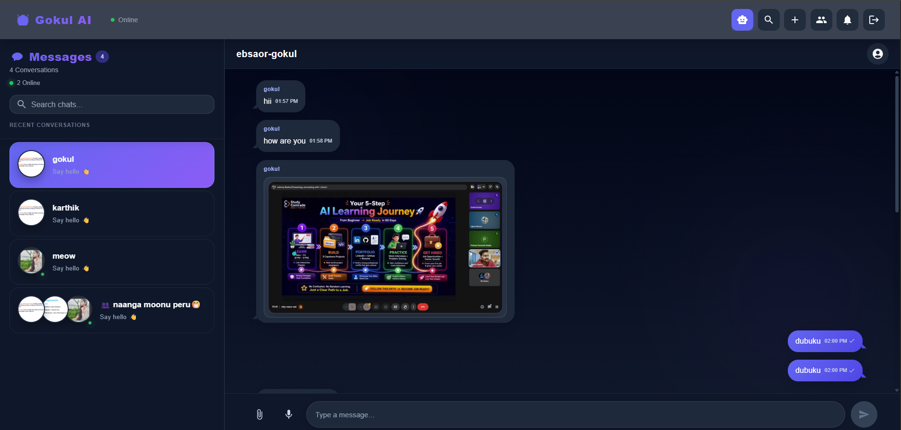
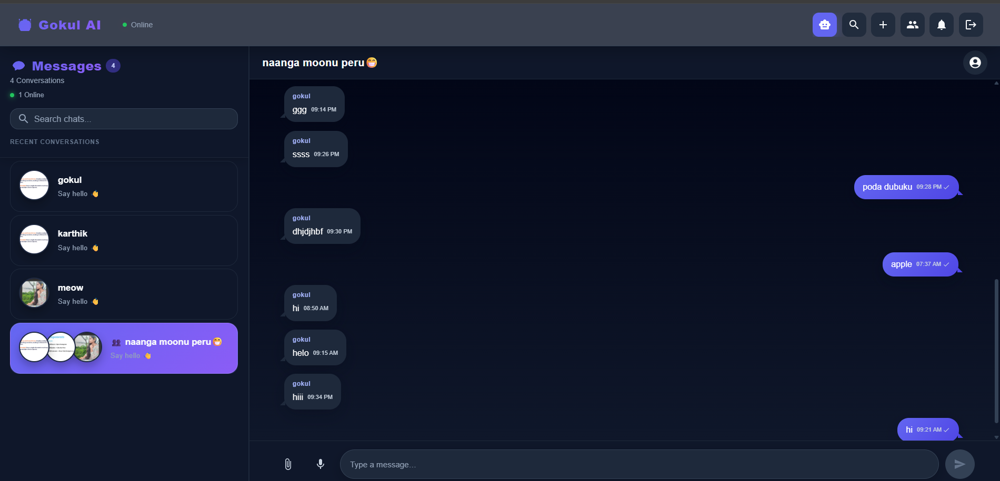
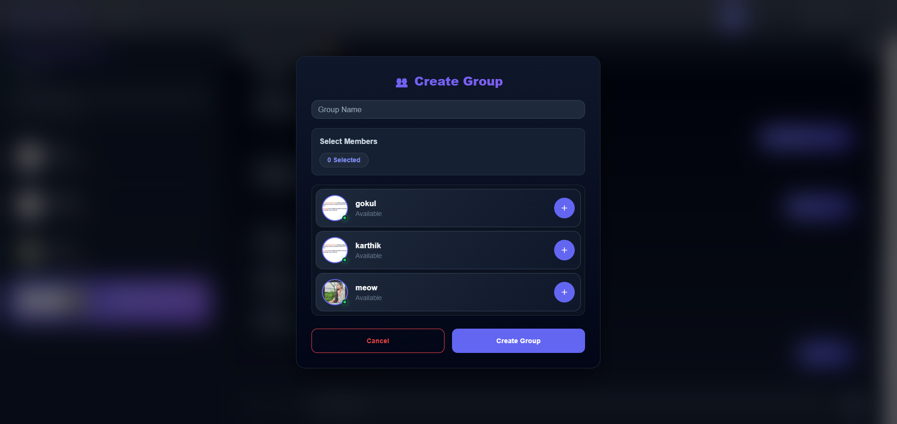
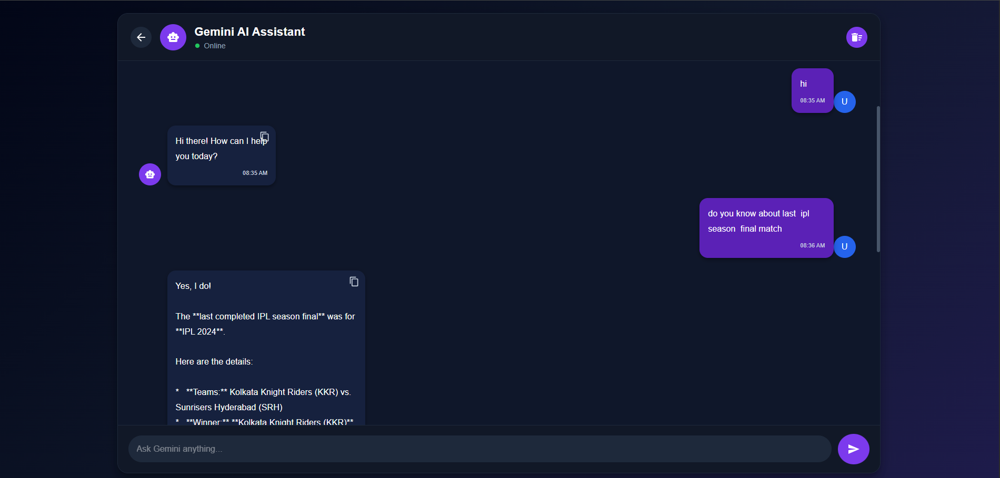

<div align="center">



# 🚀 ChatSphere AI

### 💬 Intelligent Real-Time Chat Platform Powered by AI

<p align="center">


</p>

<p align="center">

A modern full-stack **MERN Chat Application** featuring **Real-Time Messaging**, **AI-powered Conversations**, **Secure Authentication**, **Media Sharing**, and an elegant responsive interface built for modern communication.

</p>

</div>

---

## 🌟 Next Generation Communication Platform

> **ChatSphere AI** combines the power of the **MERN Stack**, **Socket.IO**, and **Google Gemini AI** to deliver an intelligent, scalable, and real-time messaging experience.

---

# 🛠️ Built With

<p align="center">


</p>

---

# 📊 GitHub Repository

<p align="center">


</p>

---

# 🌐 Live Demo

> 🚧 **Coming Soon**

| Platform | Status |
|----------|--------|
| 🌍 Frontend | Coming Soon |
| ⚙️ Backend API | Coming Soon |
| 🎥 Demo Video | Coming Soon |

---

# 📑 Table of Contents

- [✨ Project Overview](#-project-overview)
- [🎯 Why ChatSphere AI](#-why-chatsphere-ai)
- [✨ Core Features](#-core-features)
- [🤖 AI Features](#-ai-features)
- [🛠️ Technology Stack](#️-technology-stack)
- [🏗️ System Architecture](#️-system-architecture)
- [📂 Project Structure](#-project-structure)
- [⚙️ Installation Guide](#️-installation-guide)
- [🔑 Environment Variables](#-environment-variables)
- [📸 Application Showcase](#-application-showcase)
- [📊 Feature Status](#-feature-status)
- [📱 Responsive Design](#-responsive-design)
- [🔒 Security](#-security)
- [⚡ Performance](#-performance)
- [🌍 Deployment](#-deployment)
- [📈 Future Enhancements](#-future-enhancements)
- [👨‍💻 Developer](#-developer)
- [🤝 Contributing](#-contributing)
- [📄 License](#-license)
- [⭐ Support](#-support)

---
# ✨ Project Overview

ChatSphere AI is a modern full-stack real-time communication platform built to deliver a fast, secure, and intelligent messaging experience. The application combines the power of the **MERN Stack**, **Socket.IO**, and **Google Gemini AI** to enable seamless real-time conversations alongside an AI-powered assistant.

Unlike traditional messaging applications, ChatSphere AI creates an intelligent communication ecosystem where users can effortlessly switch between human conversations and AI assistance without leaving the platform.

The platform includes secure authentication, media sharing, responsive interfaces, user profile management, online presence indicators, notifications, group conversations, and cloud-based media storage.

Designed using a modular architecture, the frontend, backend, and AI service are separated into independent components, making the project scalable, maintainable, and production-ready.

---

# 🎯 Why ChatSphere AI?

Modern communication applications should offer more than just messaging. ChatSphere AI bridges the gap between traditional chat applications and intelligent virtual assistants by integrating advanced AI capabilities directly into real-time conversations.

The project demonstrates practical implementation of modern web technologies while following industry-standard software architecture and development practices.

### Key Highlights

- 🚀 Real-Time Communication
- 🤖 AI-Powered Assistant
- 🔒 Secure Authentication
- 📎 Cloud Media Sharing
- ⚡ Fast & Responsive User Interface
- 🌍 Production-Ready Architecture
- 📱 Mobile Friendly Design
- 📈 Highly Scalable Codebase

---

# 🎯 Project Goals

- Build a scalable real-time messaging platform.
- Integrate Google's Gemini AI into everyday conversations.
- Deliver secure JWT-based authentication.
- Enable cloud-based media sharing using Cloudinary.
- Build responsive interfaces for desktop and mobile.
- Demonstrate modern MERN Stack architecture.
- Showcase production-ready full-stack development practices.
- Create a solid foundation for future AI-powered features.

---

# ✨ Core Features

<table>

<tr>

<td width="50%">

## 🤖 AI Assistant

- Google Gemini AI Integration
- Intelligent Conversations
- Instant AI Responses
- Context-Aware Assistance
- Natural Language Processing
- Fast Response Generation

</td>

<td width="50%">

## 💬 Real-Time Messaging

- One-to-One Chat
- Instant Message Delivery
- Socket.IO Integration
- Online User Status
- Live Typing Experience
- Real-Time Updates

</td>

</tr>

<tr>

<td>

## 👥 Group Collaboration

- Create Chat Groups
- Manage Group Members
- Multiple Participants
- Group Conversations
- Group Administration
- Collaborative Messaging

</td>

<td>

## 📎 Media Sharing

- Image Upload
- File Sharing
- Cloudinary Integration
- Secure Cloud Storage
- Instant Preview
- Optimized Media Delivery

</td>

</tr>

<tr>

<td>

## 🔒 Authentication & Security

- JWT Authentication
- Secure Login & Signup
- Protected Routes
- Password Encryption
- User Authorization
- Secure API Access

</td>

<td>

## 👤 User Experience

- Responsive Design
- User Profiles
- Search Users
- Notification System
- Chat History
- Modern Material UI Design

</td>

</tr>

</table>

---

# 🌟 Platform Highlights

| Feature | Description |
|----------|-------------|
| 🤖 AI Assistant | Intelligent conversations powered by Google Gemini AI |
| 💬 Real-Time Chat | Instant messaging using Socket.IO |
| 👥 Group Chat | Collaborate with multiple users in groups |
| 📎 Media Sharing | Upload and share images & files securely |
| 🔒 Authentication | JWT-based secure login system |
| ☁️ Cloud Storage | Media hosted securely on Cloudinary |
| 📱 Responsive UI | Optimized for Desktop, Tablet & Mobile |
| ⚡ Fast Performance | Optimized React components with Redux Toolkit |

---
# 🤖 AI Features

ChatSphere AI integrates **Google Gemini AI** to provide intelligent, context-aware conversations directly inside the application.

Users can seamlessly switch between real-time messaging and AI-powered assistance without leaving the platform.

---

## ✨ AI Capabilities

| Feature | Description |
|----------|-------------|
| 💡 Smart Answers | Instantly answer user questions using Gemini AI |
| 🧠 Context Awareness | Understands conversational context for better responses |
| ⚡ Fast Responses | Generates responses within seconds |
| 📚 Knowledge Assistance | Helps with coding, learning, and general questions |
| 💬 Natural Conversations | Human-like conversational experience |
| 🚀 Productivity | Assists users without interrupting conversations |

---

## 🔄 AI Conversation Flow

```text
User
   │
   ▼
React Frontend
   │
REST API Request
   │
Node.js Backend
   │
Gemini Service
   │
Google Gemini AI
   │
AI Response
   │
Frontend UI
```

---

# 🛠️ Technology Stack

## Frontend

| Technology | Purpose |
|------------|---------|
| React.js | User Interface |
| Vite | Build Tool |
| Redux Toolkit | Global State Management |
| Material UI | Modern UI Components |
| Axios | API Communication |

---

## Backend

| Technology | Purpose |
|------------|---------|
| Node.js | Runtime Environment |
| Express.js | REST API Framework |
| Socket.IO | Real-Time Communication |
| JWT | Authentication |
| Bcrypt | Password Encryption |

---

## Database & Cloud

| Technology | Purpose |
|------------|---------|
| MongoDB Atlas | Database |
| Mongoose | ODM |
| Cloudinary | Cloud Media Storage |

---

## AI Services

| Technology | Purpose |
|------------|---------|
| Google Gemini AI | AI Assistant |
| Gemini API | Intelligent Response Generation |

---

## Development Tools

| Technology | Purpose |
|------------|---------|
| Git | Version Control |
| GitHub | Repository Hosting |
| VS Code | Development Environment |
| Postman | API Testing |

---

# 🏗️ System Architecture



---

# 🔄 Request Flow



---

# ⚙️ Backend Workflow

```text
Client Request
      │
      ▼
Express Router
      │
      ▼
Middleware
(Authentication / Validation)
      │
      ▼
Controller
      │
 ┌────┴────────────┐
 │                 │
 ▼                 ▼
MongoDB        Gemini AI
 │                 │
 └──────┬──────────┘
        ▼
Business Logic
        │
        ▼
JSON Response
        │
        ▼
Frontend
```

---

# 🎯 Project Architecture Highlights

- 🧩 Modular MERN Architecture
- ⚡ Real-Time Socket.IO Communication
- 🤖 Independent Gemini AI Service
- ☁️ Cloudinary Media Storage
- 🔐 JWT Protected APIs
- 📦 Scalable Folder Structure
- 🚀 Production-Ready Design
- 📱 Responsive Client Application

---
# 📂 Project Structure

```text
ChatSphere-AI-MERN-App
│
├── 📁 frontend
│   ├── public
│   ├── src
│   │
│   ├── assets
│   ├── components
│   ├── constants
│   ├── dialogs
│   ├── hooks
│   ├── layouts
│   ├── pages
│   ├── redux
│   ├── utils
│   ├── App.jsx
│   └── main.jsx
│
│   └── package.json
│
├── 📁 backend
│   ├── config
│   ├── constants
│   ├── controllers
│   ├── lib
│   ├── middleware
│   ├── models
│   ├── routes
│   ├── socket
│   ├── utils
│   ├── app.js
│   └── server.js
│
├── 📁 gemini-service
│   ├── server.js
│   ├── script.js
│   └── package.json
│
├── README.md
├── .gitignore
└── package.json
```

---

# 📁 Folder Explanation

| Folder | Description |
|---------|-------------|
| **frontend/** | React + Vite client application |
| **backend/** | Express REST API & Socket.IO server |
| **gemini-service/** | Independent AI microservice powered by Gemini |
| **components/** | Reusable React UI components |
| **pages/** | Application pages/screens |
| **redux/** | Global state management |
| **controllers/** | Business logic for APIs |
| **models/** | MongoDB schemas |
| **routes/** | REST API routes |
| **middleware/** | Authentication & validation |
| **socket/** | Socket.IO event handlers |
| **utils/** | Utility/helper functions |

---

# ⚙️ Installation Guide

## 1️⃣ Clone the Repository

```bash
git clone https://github.com/Gokul768/ChatSphere-AI-MERN-App.git

cd ChatSphere-AI-MERN-App
```

---

## 2️⃣ Install Frontend

```bash
cd frontend

npm install

npm run dev
```

Frontend runs on

```
http://localhost:5173
```

---

## 3️⃣ Install Backend

```bash
cd backend

npm install

npm start
```

Backend runs on

```
http://localhost:5000
```

---

## 4️⃣ Install Gemini Service

```bash
cd gemini-service

npm install

npm start
```

Gemini Service runs on

```
http://localhost:8000
```

---

# ▶️ Running the Complete Project

Open **three terminals**.

### Terminal 1

```bash
cd frontend
npm run dev
```

---

### Terminal 2

```bash
cd backend
npm start
```

---

### Terminal 3

```bash
cd gemini-service
npm start
```

---

# 🔑 Environment Variables

Create a **.env** file inside the **backend** directory.

```env
PORT=5000

MONGO_URI=your_mongodb_connection_string

JWT_SECRET=your_jwt_secret

CLOUDINARY_CLOUD_NAME=your_cloud_name

CLOUDINARY_API_KEY=your_api_key

CLOUDINARY_API_SECRET=your_api_secret

GEMINI_API_KEY=your_gemini_api_key
```

---

## 📌 Environment Variable Description

| Variable | Purpose |
|----------|---------|
| PORT | Backend server port |
| MONGO_URI | MongoDB Atlas connection string |
| JWT_SECRET | JWT authentication secret |
| CLOUDINARY_CLOUD_NAME | Cloudinary cloud name |
| CLOUDINARY_API_KEY | Cloudinary API key |
| CLOUDINARY_API_SECRET | Cloudinary secret key |
| GEMINI_API_KEY | Google Gemini API key |

---

## ⚠️ Important Notes

- Never commit your `.env` file.
- Add `.env` to `.gitignore`.
- Keep API keys private.
- Rotate secrets if they are ever exposed.

---

# 🧪 Testing the Application

After starting all services:

✅ Open the frontend.

```
http://localhost:5173
```

You should now be able to:

- ✅ Register a new account
- ✅ Login securely
- ✅ Start one-to-one conversations
- ✅ Create group chats
- ✅ Upload images & files
- ✅ Chat with Gemini AI
- ✅ Receive real-time messages
- ✅ View online users

---

# 📦 Production Build

Generate an optimized frontend build.

```bash
cd frontend

npm run build
```

Preview the production build locally.

```bash
npm run preview
```

---

# 🚀 Deployment Ready

The application is designed for cloud deployment.

| Service | Recommended Platform |
|----------|----------------------|
| Frontend | Vercel |
| Backend | Railway |
| Database | MongoDB Atlas |
| AI Service | Railway / Render |
| Media Storage | Cloudinary |

---
# 📸 Application Showcase

Explore the major screens of **ChatSphere AI**, designed with a clean, modern interface and a responsive user experience.

---

## 🔐 Authentication

<p align="center">
  
  
</p>

**Features**

- Secure Login
- New User Registration
- JWT Authentication
- Password Validation
- Responsive Design

---

## 🏠 Home Dashboard

<p align="center">
  
</p>

**Features**

- Sidebar Navigation
- Recent Conversations
- Online Users
- Search Functionality
- Clean Material UI Design

---

## 💬 Real-Time Messaging

<p align="center">
  
</p>

**Features**

- Instant Messaging
- Socket.IO Communication
- Typing Experience
- Message History
- Online Presence

---

## 👥 Group Conversations

<p align="center">
  
</p>

**Features**

- Multiple Participants
- Group Discussions
- Group Management
- Real-Time Updates

---

## ➕ Create New Group

<p align="center">
  
</p>

**Features**

- Create Groups
- Add Members
- Group Name Selection
- Easy Management

---

## 🤖 AI Assistant

<p align="center">
  
</p>

**Features**

- Gemini AI Integration
- Intelligent Responses
- Coding Assistance
- Knowledge Support
- Natural Language Conversations

---

# 📊 Feature Status

| Feature | Status |
|----------|:------:|
| 🔐 Authentication | ✅ |
| 👤 User Registration | ✅ |
| 💬 One-to-One Chat | ✅ |
| 👥 Group Chat | ✅ |
| 🤖 Gemini AI Chat | ✅ |
| 📎 Image Upload | ✅ |
| 📁 File Sharing | ✅ |
| ☁️ Cloudinary Integration | ✅ |
| ⚡ Socket.IO Messaging | ✅ |
| 🟢 Online Status | ✅ |
| 🔍 User Search | ✅ |
| 🔔 Notifications | ✅ |
| 📱 Responsive UI | ✅ |
| 🌙 Dark Mode | 🚧 |
| 😊 Emoji Support | 🚧 |
| 📞 Audio Calling | 🚧 |
| 📹 Video Calling | 🚧 |
| 🌍 Multi-language Support | 🚧 |

> ✅ Completed &nbsp;&nbsp; 🚧 Planned for Future Releases

---

# 📱 Responsive Design

ChatSphere AI is designed to provide a consistent experience across multiple screen sizes.

| Device | Supported |
|---------|:---------:|
| 🖥 Desktop | ✅ |
| 💻 Laptop | ✅ |
| 📱 Mobile | ✅ |
| 📲 Tablet | ✅ |

### Responsive Highlights

- Flexible Layouts
- Mobile-Friendly Navigation
- Adaptive Components
- Responsive Material UI
- Optimized Chat Interface

---

# 🔒 Security Features

Security is one of the primary focuses of ChatSphere AI.

| Security Feature | Status |
|------------------|:------:|
| JWT Authentication | ✅ |
| Password Encryption | ✅ |
| Protected API Routes | ✅ |
| Secure User Sessions | ✅ |
| Input Validation | ✅ |
| Cloudinary Secure Uploads | ✅ |
| Environment Variable Protection | ✅ |
| MongoDB Secure Connection | ✅ |

---

# ⚡ Performance Optimizations

ChatSphere AI is optimized to deliver a smooth user experience.

### Frontend

- ⚛️ Optimized React Components
- ⚡ Fast Rendering with Vite
- 🧠 Efficient Redux Toolkit State Management
- 📦 Component Reusability
- 🔄 Optimized API Calls

---

### Backend

- 🚀 Lightweight Express Server
- ⚡ Fast REST API Responses
- 🔄 Efficient Socket.IO Communication
- 📁 Optimized File Uploads
- 🗄 Efficient MongoDB Queries

---

### User Experience

- Instant Messaging
- Fast AI Responses
- Smooth Navigation
- Responsive Layout
- Optimized Image Loading
- Reduced Network Requests

---

# 📈 Project Highlights

- 🚀 Modern MERN Stack Architecture
- 🤖 Google Gemini AI Integration
- 💬 Real-Time Communication
- 👥 Group Collaboration
- 📎 Secure Media Sharing
- 🔒 JWT Authentication
- ☁️ Cloudinary Integration
- 📱 Fully Responsive UI
- ⚡ Production-Ready Codebase

---
# 🌍 Deployment

ChatSphere AI is designed to be easily deployed using modern cloud platforms.

| Service | Recommended Platform |
|----------|----------------------|
| 🌐 Frontend | Vercel |
| ⚙️ Backend | Railway |
| 🍃 Database | MongoDB Atlas |
| 🤖 Gemini Service | Railway / Render |
| ☁️ Media Storage | Cloudinary |

---

## 🚀 Deployment Steps

### Frontend (Vercel)

```bash
cd frontend

npm run build
```

Deploy the generated build to **Vercel**.

---

### Backend (Railway)

```bash
cd backend

npm install

npm start
```

Deploy the backend to **Railway** and configure all required environment variables.

---

### Database

Create a **MongoDB Atlas** cluster.

Update the `.env` file with:

```env
MONGO_URI=your_mongodb_connection_string
```

---

### AI Service

Deploy the **Gemini Service** independently on Railway or Render.

Configure:

```env
GEMINI_API_KEY=your_api_key
```

---

### Cloudinary

Configure:

```env
CLOUDINARY_CLOUD_NAME=

CLOUDINARY_API_KEY=

CLOUDINARY_API_SECRET=
```

---

# 🛣️ Project Roadmap

## ✅ Version 1.0

- JWT Authentication
- Real-Time Chat
- Group Chat
- Gemini AI Integration
- Cloudinary Upload
- Responsive UI

---

## 🚧 Version 2.0

- Emoji Support
- Message Reactions
- Read Receipts
- Typing Indicators Improvements
- Drag & Drop Upload
- Chat Search

---

## 🚀 Version 3.0

- Voice Messages
- Audio Calling
- Video Calling
- AI Chat Memory
- AI Chat Summary
- Pinned Messages
- User Themes

---

# 📈 Future Enhancements

- 🌙 Dark Mode
- 😊 Emoji Picker
- 📹 Video Calling
- 📞 Voice Calling
- 🎙 Voice Messages
- 🤖 AI Memory
- 📄 AI Conversation Summary
- 🌍 Multi-language Support
- ⭐ Favorite Messages
- 📌 Pinned Chats
- 🔔 Push Notifications
- 📂 Drag & Drop Upload
- 🔐 End-to-End Encryption
- 📊 User Analytics
- 🧠 Smart AI Suggestions

---

# 🤝 Contributing

Contributions are welcome!

If you'd like to improve ChatSphere AI, follow these steps:

```bash
# Fork the repository

# Clone your fork

git clone https://github.com/your-username/ChatSphere-AI-MERN-App.git

# Create a new branch

git checkout -b feature/YourFeature

# Commit changes

git commit -m "Add new feature"

# Push

git push origin feature/YourFeature

# Open Pull Request
```

---

# 🐞 Report Issues

If you find any bugs or have feature requests:

1. Open an Issue
2. Describe the problem
3. Attach screenshots (if applicable)
4. Explain how to reproduce it

---

# 👨‍💻 Developer

<div align="center">

## Gokul

### Full Stack MERN Developer

Passionate about building scalable, AI-powered web applications using modern technologies.

</div>

---

## 💻 Skills

- React.js
- Node.js
- Express.js
- MongoDB
- Redux Toolkit
- Socket.IO
- Material UI
- REST APIs
- JWT Authentication
- Cloudinary
- Google Gemini AI

---

## 🌟 Connect With Me

<p align="center">

<a href="https://github.com/Gokul768">

</a>

<!-- Add LinkedIn -->

<!-- Add Portfolio -->

<!-- Add Email -->

</p>

---

# 📄 License

This project is licensed under the **MIT License**.

Feel free to use, modify, and distribute this project for educational and personal purposes.

---

# ⭐ Support the Project

If you found this project helpful, please consider giving it a ⭐ on GitHub.

It helps others discover the project and motivates further development.

<p align="center">

⭐ ⭐ ⭐ ⭐ ⭐

</p>

---

# ❤️ Acknowledgements

Special thanks to the amazing open-source community and the creators of:

- React
- Node.js
- Express.js
- MongoDB
- Socket.IO
- Material UI
- Cloudinary
- Google Gemini AI

---

<div align="center">

# 🚀 ChatSphere AI

### Intelligent Conversations. Real-Time Connections.

Built with ❤️ by **Gokul**

---

⭐ Thank you for visiting this repository!

If you enjoyed this project, don't forget to leave a **Star ⭐**

Happy Coding! 🚀

</div>